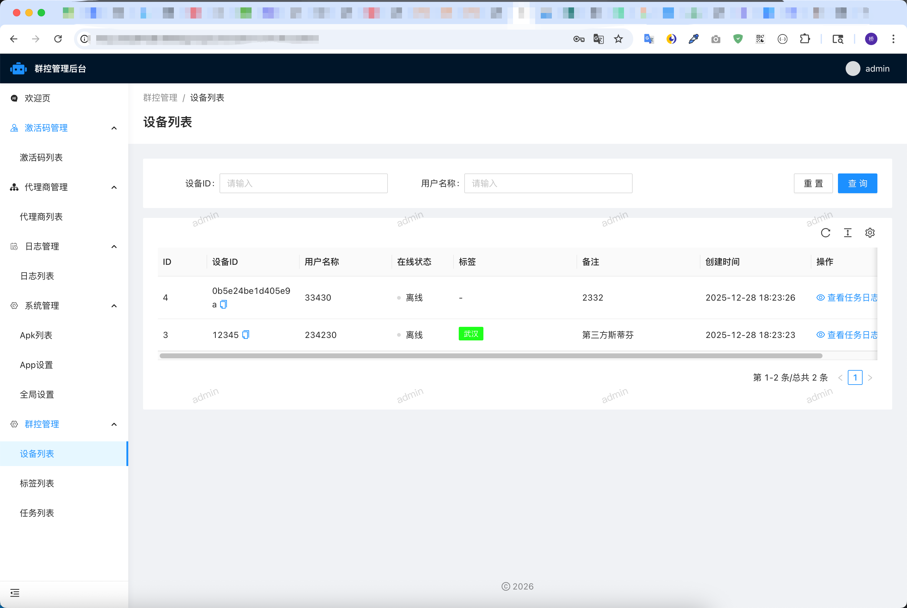
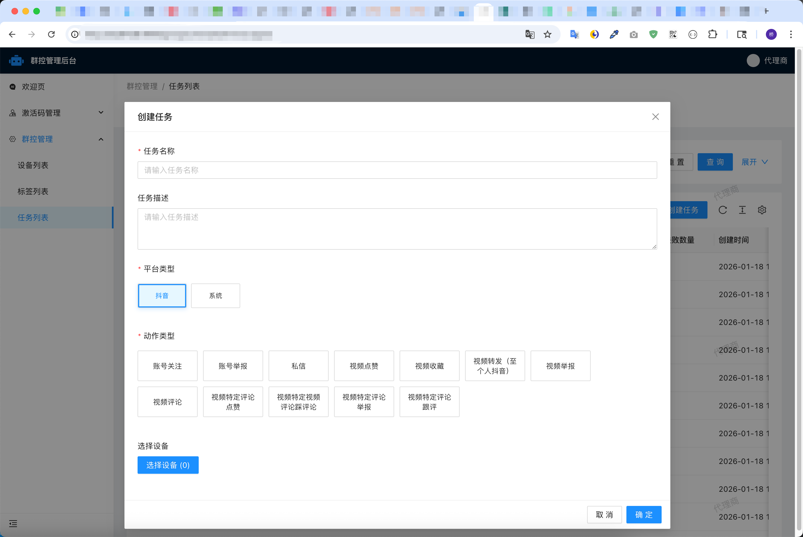
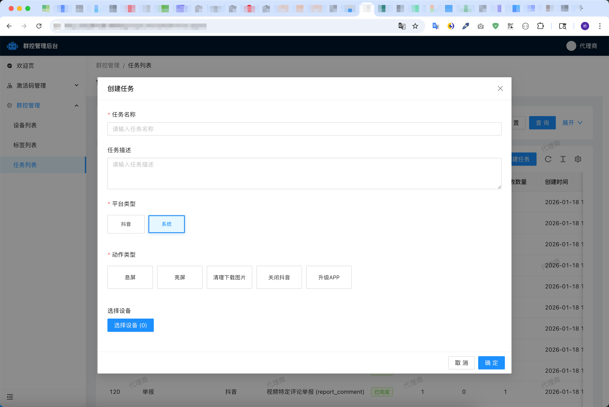
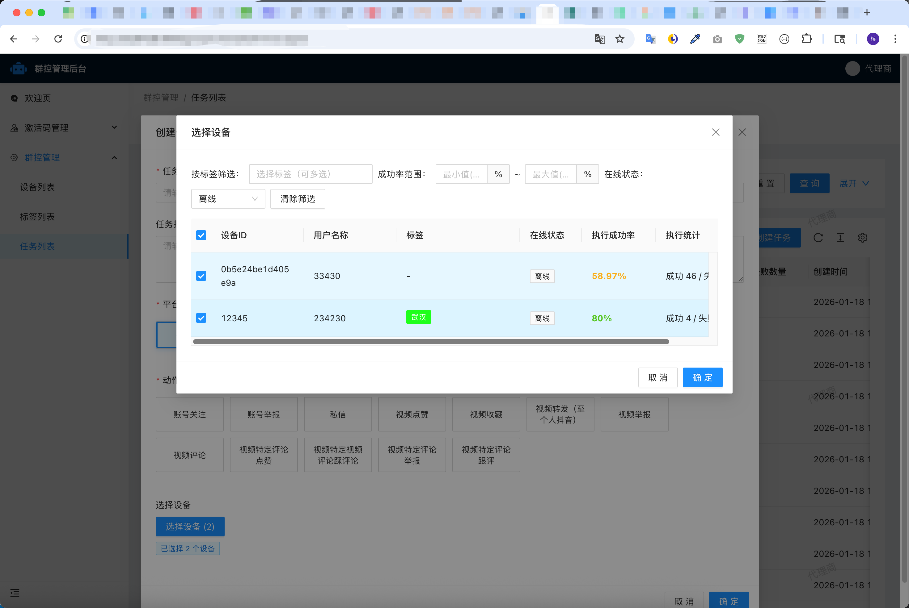
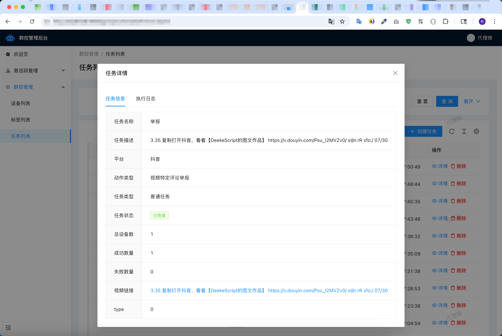
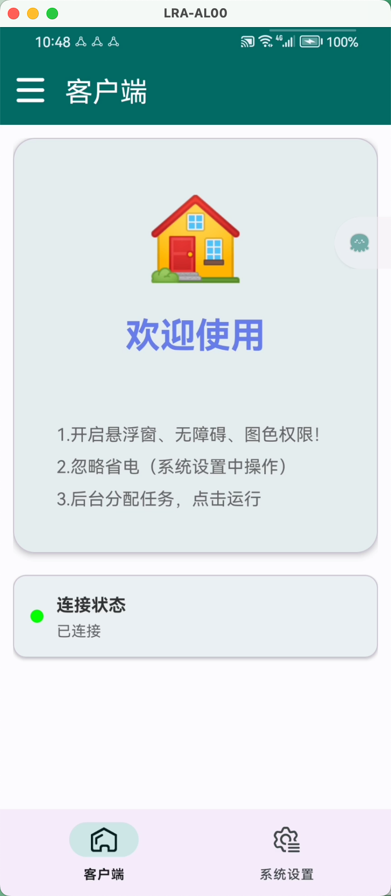
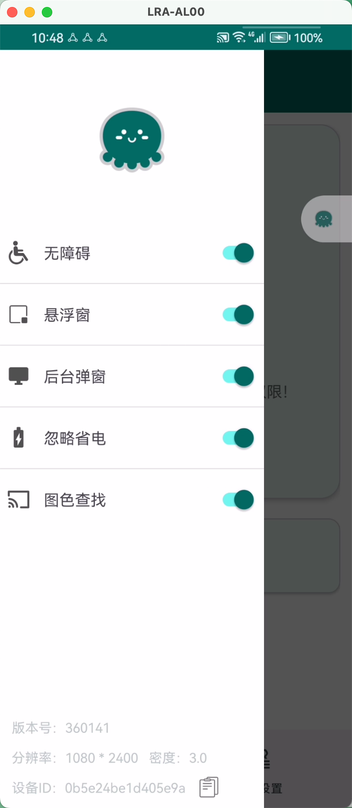
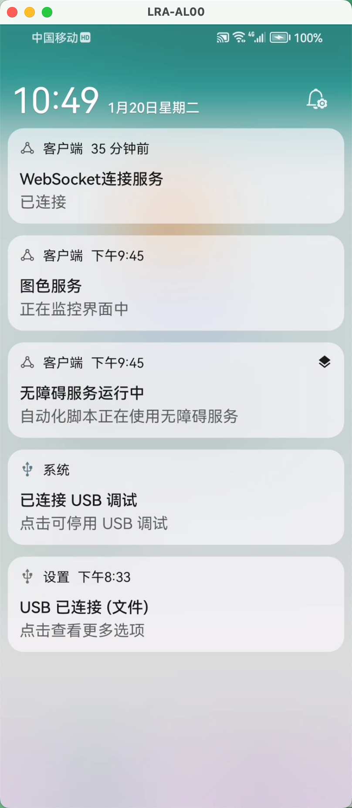
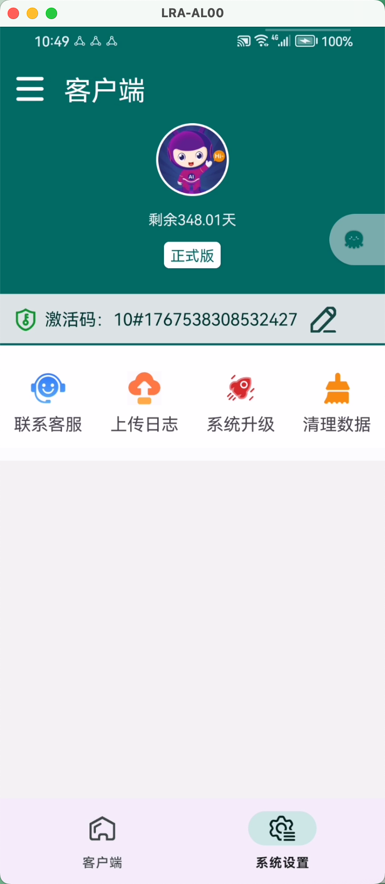

# 抖音群控系统 - TikTok Group Control System

<div align="center">


**基于 [DeekeScript](https://doc.deeke.cn) 底层框架的企业级抖音群控解决方案**

[功能特性](#功能特性) • [技术架构](#技术架构) • [系统优势](#系统优势) • [快速开始](#快速开始)

</div>

---

## 📖 项目简介

> 本项目非开源、非免费项目！有需要请划到页面底部联系作者！
>
> 本系统可贴牌（定价4800元，源码6800元，不得用于非法用途！）

抖音群控系统是一套专业的企业级设备批量管理与自动化操作平台，基于 **[DeekeScript](https://doc.deeke.cn)** 底层框架构建，具备多年的 RPA（机器人流程自动化）技术沉淀。系统支持大规模 Android 设备集中管理，实现抖音平台操作的批量执行，同时提供强大的系统级控制能力。

### 核心价值

- 🚀 **高效批量操作**：单次支持 2000+ 台设备同时执行任务
- 🔒 **企业级安全**：完善的权限体系与数据加密机制
- ⚡ **实时通信**：基于 WebSocket 的毫秒级任务分发
- 🛡️ **稳定可靠**：连接断线自动恢复，任务执行状态实时追踪
- 🎯 **系统级控制**：支持息屏、亮屏、批量静默升级 APP 等深度操作
- 📦 **多企业管理**：实现多企业部署群控，轻松实现账号隔离

---

## ✨ 功能特性

### 📱 抖音平台操作

#### 账号管理
- ✅ 账号关注 / 取消关注
- ✅ 账号举报（支持多级分类：不当内容、色情交易、未成年相关、欺诈、人身安全、网络暴力等）
- ✅ 私信发送

#### 视频互动
- ✅ 视频点赞 / 取消点赞
- ✅ 视频收藏
- ✅ 视频转发（至个人抖音）
- ✅ 视频举报（支持详细分类）
- ✅ 视频评论 / 评论回复
- ✅ 评论点赞 / 取消点赞
- ✅ 评论踩 / 取消踩
- ✅ 评论举报

### 🖥️ 系统级控制

- 🔋 **息屏 / 亮屏**：远程控制设备屏幕状态
- 📦 **批量静默升级 APP**：无需人工干预，自动批量更新应用
- 🗑️ **清理相册**：自动清理下载图片，释放存储空间
- 📱 **关闭抖音**：远程关闭应用进程

### 🎛️ 设备管理

- 📋 **设备列表管理**：添加、编辑、删除设备
- 🏷️ **标签分组**：灵活的标签系统，支持设备分组管理
- 📊 **在线状态监控**：实时显示设备在线/离线状态
- 📈 **执行统计**：任务成功/失败统计，设备执行历史追踪

### 📋 任务管理

- ➕ **任务创建**：可视化任务配置，支持复杂参数设置
- ▶️ **批量执行**：一键下发任务到多台设备
- 🔄 **任务撤回**：支持已执行任务的撤回操作
- 📝 **执行日志**：详细的任务执行记录，包含成功/失败原因
- 📊 **任务统计**：实时查看任务执行进度与结果

### 👥 权限管理

- 🔐 **三级权限体系**：管理员、代理商
- 🎯 **精细化权限控制**：按角色分配功能访问权限
- 📝 **操作日志**：完整的用户操作审计日志

---

## 🏗️ 技术架构

### 系统架构图

```
┌─────────────────────────────────────────────────────────────┐
│                      Web 管理后台                            │
│              (Laravel 12.0 + Antd Design)                        │
└──────────────────────┬──────────────────────────────────────┘
                       │ HTTP/HTTPS API
                       │ JWT 认证
┌──────────────────────▼──────────────────────────────────────┐
│                  后端服务层 (Laravel)                         │
│  ┌──────────────┐  ┌──────────────┐  ┌──────────────┐       │
│  │  任务管理     │  │   设备管理     │  │   权限管理    │       │
│  └──────────────┘  └──────────────┘  └──────────────┘       │
└──────────────────────┬──────────────────────────────────────┘
                       │
        ┌──────────────┼──────────────┐
        │              │              │
┌───────▼──────┐ ┌────▼────┐ ┌──────▼──────┐
│  WebSocket   │ │  Redis  │ │   MySQL     │
│   Server     │ │  Queue  │ │  Database   │
│  (Swoole)    │ │         │ │             │
└───────┬──────┘ └─────────┘ └─────────────┘
        │
        │ WebSocket 实时通信
        │
┌───────▼──────────────────────────────────────────────────────┐
│              Android 客户端 (DeekeScript)                     │
│  ┌─────────────┐  ┌──────────────┐  ┌──────────────┐         │
│  │  任务执行    │  │    系统控制    │  │   状态上报    │         │
│  └─────────────┘  └──────────────┘  └──────────────┘         │
└──────────────────────────────────────────────────────────────┘
```


## 🛡️ 系统优势

### 稳定性保障

- ✅ **连接保活机制**：WebSocket 心跳检测，自动重连
- ✅ **任务队列管理**：Redis 队列确保任务不丢失
- ✅ **断线自动处理**：设备断开时自动标记任务状态
- ✅ **异常恢复机制**：任务执行失败自动记录，支持重试
- ✅ **高并发支持**：Swoole 多进程架构，支持大规模设备连接

### 安全性保障

- 🔐 **多重身份验证**：设备激活码 + Token + 时间戳验证
- 🔒 **数据加密传输**：HTTPS/WSS 加密通信
- 🛡️ **权限隔离**：三级权限体系，数据隔离
- 📝 **操作审计**：完整的操作日志记录
- ⏱️ **请求限流**：API 限流保护，防止恶意请求
- 🔑 **密钥管理**：安全的密钥存储与轮换机制

### 性能优势

- ⚡ **实时通信**：WebSocket 毫秒级任务分发
- 🚀 **批量处理**：单次支持 2000+ 设备同时操作
- 📊 **异步任务**：Laravel Queue 异步处理日志记录
- 💾 **缓存优化**：Redis 缓存热点数据，提升响应速度

---

## 🎯 应用场景

- 📱 **内容运营**：批量点赞、评论、关注，提升内容曝光
- 🛡️ **内容审核**：批量举报违规内容，维护平台生态
- 📊 **数据分析**：批量采集数据，支持业务决策
- 🔄 **账号管理**：批量管理多账号，提升运营效率
- 🎬 **营销推广**：批量互动，扩大品牌影响力

---

## 📸 系统截图

### 后台管理系统







### Android 客户端

<div style="display: flex; justify-content: space-between;flex-wrap: wrap;row-gap: 16px;">
    
    
    
    
</div>

---

## 🔧 关于 DeekeScript

**DeekeScript** 是我们团队自主研发的 Android 自动化底层框架，具备以下特点：

- 🎯 **专业 RPA 引擎**：多年的 RPA 技术沉淀，稳定可靠
- 🔧 **系统级能力**：支持息屏、亮屏、静默安装等深度系统操作
- 📱 **跨应用支持**：不仅限于抖音，可扩展至其他应用
- 🚀 **高性能执行**：优化的执行引擎，任务执行速度快
- 🛡️ **安全可靠**：经过大量生产环境验证，Deeke 产品畅销多年

基于 DeekeScript 的底层能力，本系统能够实现更稳定、更高效的设备控制与任务执行。

---

## 📊 系统监控

系统提供完善的监控能力：

- 📈 **实时设备状态**：在线/离线设备统计
- 📊 **任务执行统计**：成功率、失败率分析

---


## 📞 联系我们


---